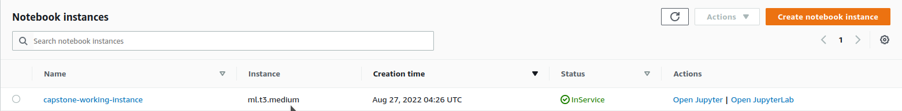
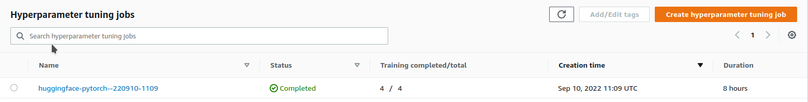
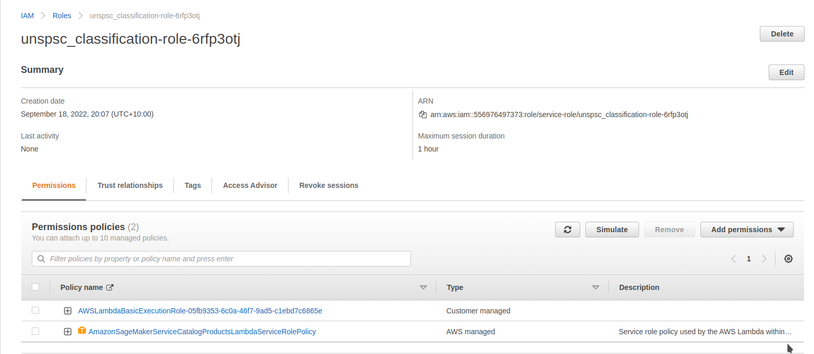
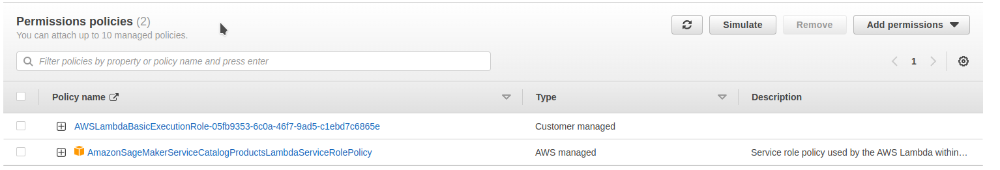
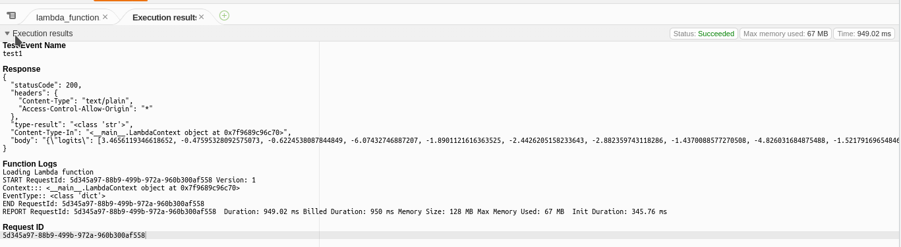
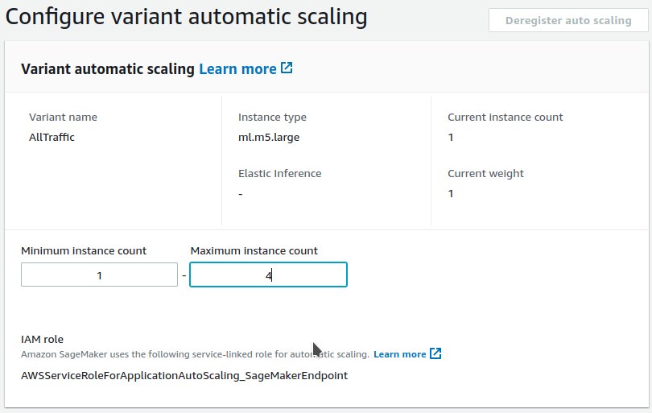
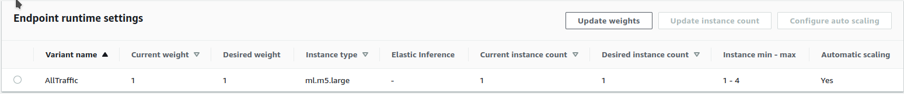
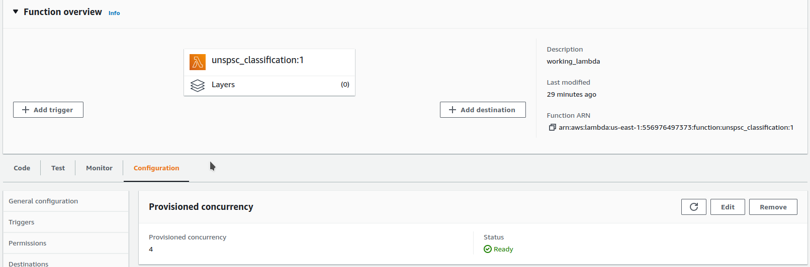
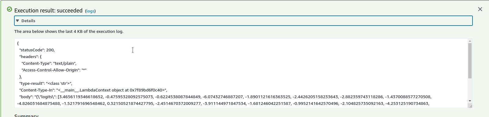
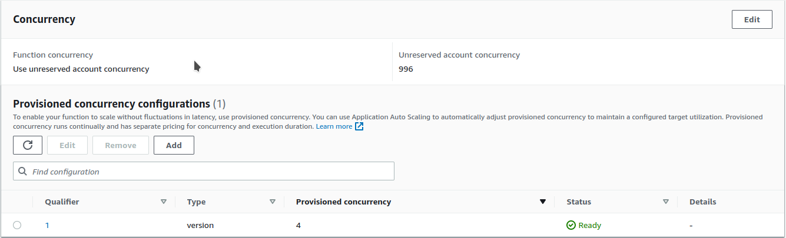

# UNSPSC Classification

This project prepares a classifier for the United Nations Standard Product and Services Classification system using the SageMaker Ecosystem. It is completed in partial satisfaction of the Udacity AWS Machine Learning Engineer NanoDegree. 


## TL:DR

The United Nations Standard Product & Service Classification categorises goods and services into a hierarchy of classification areas which are non-overlapping and provide good coverage of typical product and services. Procurement organisations use these classifications to identify what money they are spending. This git repo contains conde which will (in a properly configured AWS environment) automate the process of downloading training data, training models and deploying these models to an endpoint to use in production for classification. It also provides information on how to configure AWS infrastructure to enable this deployment.

Training data is all in the public domain and provided by various anglophone governments.

The file `running_notebook.ipynb` will guide you through the process of running the code. This script will also download data for you as required.

The size of notebook required for this model is modest. I used an `ml.t3.medium` instance.




## Problem Definition

When describing what goods and services are procured, it is necessary to have a common langauge to categorise these goods and services. Descriptors of goods and services are most often provided in short text descriptions and require manual encoding to categorise them. This categorisation is frequently subject and often relies upon the skill of the coder to ensure that items are correclty classified. Additionally, in order to be useful, classification systems must provide sufficient (but not too many) classifications with interpretable content to allow reprorting from these classification systmes to be understood by non-technical audiences.

### Trade Mark Use Case


#### Concerning Nice Classification

The Nice Classfiication system of goods and services provides 45 high level classification symbols to assign goods and service usage information to trade marks. Trade marks may exist in all 45 of these symbols concurrently, or they may be limited to one or two specific symbols. The Nice Classification system is insufficiently specific for the purposes of identifying goods and services to which current and prospective trade marks may be applied. 


#### Goods & Services Item Descriptions

When an application for a trade mark is submitted, along with classification information in the relevant standard (most nations use Nice -- the US has its own system), applicants are required to submit descriptions in plain language of the goods and services to which their prospective mark may attach. Consider, for example, Australian Trade Mark number 957064:

> Edible sandwiches for consumption on or off the premises, coffee, coffee substitutes, tea, cocoa, sugar, honey, rice, tapioca, flour, breakfast cereals, processed cereals, cereal-based snack foods and ready to eat cereal-derived food bars; bread, biscuits, cakes, pastries, dairy-based shakes, soft-serve ice cream, ice milk and frozen yoghurt; yeast, baking powder, salt, mustard, pepper, sauces, spices, seasonings and ice.<br>
> See https://search.ipaustralia.gov.au/trademarks/search/view/957064 Class 30.

This is a partial goods and services item description for the "I'm lovin' it" mark used by McDonald's Restaurants in Australia. Let us consider the definition provided by WIPO for Nice Class 30:

>Coffee, tea, cocoa and substitutes therefor; rice, pasta and noodles; tapioca and sago; flour and preparations made from cereals; bread, pastries and confectionery; chocolate; ice cream, sorbets and other edible ices; sugar, honey, treacle; yeast, baking-powder; salt, seasonings, spices, preserved herbs; vinegar, sauces and other condiments; ice (frozen water).<br>
> See https://www.wipo.int/classifications/nice/nclpub/en/fr/?basic_numbers=show&class_number=30

We should pay attention though that this trade mark also has items in Nice Class 29. WIPO says that Nice class 29 is:

>Meat, fish, poultry and game; meat extracts; preserved, frozen, dried and cooked fruits and vegetables; jellies, jams, compotes; eggs; milk, cheese, butter, yogurt and other milk products; oils and fats for food.<br>
>See https://www.wipo.int/classifications/nice/nclpub/en/fr/?basic_numbers=show&class_number=29

While the items that are covered between the two classes are clearly different, the short descriptions make it very difficult to identify what a relative rise in the number of class 30 trade marks would mean for the food branding sector over an increase in the number of class 29 trade marks. When providing high level reporting on brand landscapes, the use of Nice classification as a category variable is very difficult and in practice it is rarely used in such analysis in my experience.


### What is UNSPSC

The United Nations Standard Product & Service Classification categorises goods and services into a hierarchy of classification areas which are non-overlapping and provide good coverage of typical product and services. The standard has four levels of classification:

1. Segment
2. Family
3. Class
4. Commodity


At the highest level, there are around 57 market segments and at the most granular, there are in the tens of thousands of commodities. This allows for scalable classification specificity. Market segement classification is enough to provide equivalent levels of granularity to Nice. In addition, the meaning of the classification symbols is much more clear:

Consier the UNSPSC classification description for market Segment code 23000000:

>23000000, Industrial Manufacturing and Processing Machinery and Accessories

We are able to get a good understanding of the likely things that may be included within the classification symbol from the description alone. Application of the UNSPSC Classification, therefore, to the goods and services item descriptions of trade marks would allow more useful analysis of the brand space than the Nice classification system alone. Additionally, if we are able to further extend this work to more granular levels of the classification standard, we can significantly enhance the utility of Trade Mark data to both IP offices and the general public.


### Available Data 

In order to train a classifier, it is necessary to identify labelled datasets of goods and service descriptions which can be used to train a natural language classification model. The main domain of use currently of the UNSPSC classification system appears to be in the area of procurement descriptions for expense reports. Importantly, three governments were identified with open data holdings which provide both the tagged UNSPSC code (usually at the Commodity level), along with a written description of varying lengths of the goods and services procured. Data is available from:

1. Californian Government
2. Australian Government
3. Canadian Government

However, the Canadian data is not mature yet as Canada is in the process of abandoning a legacy coding system in favour of the adoption of the UNSPSC system for providing procurement data to the general public. As a result, it was abandoned.


#### Exploitation of Code Hierarchies

Code data itself is provided by the government of Oklahoma. As our intent is to classify only to the highest level of the classification system, we can use all of the descriptions of more granular classification symbols nested within the target as additional training data. This training data is also highly valuable as because it is from the classification system itself, it is extremely clean in comparison to the procurement data.

The other consequence of classification information being provided by procurement agencies is that these descriptions can be inferred to belong to the classes at all higher levels of classification than the one that they are provided. That is, a code description 


### Performance Metrics

When building the classifier, we need to be aware of how we would measure the success of the project. Initially, the original scoping of the project deemed that accuracy would the best metric by which to measure the accuracy of the classifier. However, when considering the significant class imbalance problems present in the dataset (please see the sections below), it was decided to employ a [balanced accuracy score from sklearn](https://scikit-learn.org/stable/modules/generated/sklearn.metrics.balanced_accuracy_score.html#sklearn.metrics.balanced_accuracy_score). This metric is the average of the recall on each of the classes. This corrects in the case of imbalanced class datasets by preventing a classifier from being rewarded from merely biasing all classification to the over-represented class. Even where the support for a class is small, failure to correctly classify members of this class is equally weighted with classes which have higher support. This will lead to a classifier that has better performance across unseen data than one that exploits the imbalance in the training set.

## Analysis

### Dataset Preparation

The file [`wrangling_segment.py`](./wrangling_segment.py) allows the user to specify either to use segment, family or specify their own summary groups of the above. This function is intended to be used in cases where a series of classifiers are used to first conduct preclassification into groups prior to classification into a target.

If the flag `--download` is passed to this script, the script will download and unpack the dataset files from the open data repositories that source them.

For the purposes of the demonstration of this project, it is sufficient to demonstrate the capabilities of this classification system to simply train at the family level.

As part of this preprocessing script, the following steps are conducted to preprocess the data:

1. If required strips html tags from the descriptions.
2. Strips accents from descriptions.
3. Strips excessive white space.
4. Strips extraneous carriage returns.


### Sequence Length

After this processing, exploratory analysis was conducted in accordance with the content of [`exploratory_data_analysis.ipynb`](./exploratory_data_analysis.ipynb) in this repository. The median length of the descriptions sequences is 6 words after preprocessing. The modal sequence length was 4 words. The distribution is heavily right skewed. 

In order to ensure maximum sequence preservation, I note that a large sequence length was chosen for trimming activities. Less than 1% of the data was found to have over 128 words. This means that choosing to trim sequences of this length is highly unlikely to affect the performacne of the classifier.


### Class Imbalance

In the exploratory data analysis, it was noted that there are significant class imbalance issues in the dataset at the family level. The largest class was noted to have only 85 members, while the largest was found to have over 55,000 members. These datasets are obtained from a combination of processed classification standard datasets as well as government purchasing record datasets. There are products and services which governments are unlikely to procure compared to the general population. As a result, class imbalance given the bias of the training data was not unexpected. Class imbalance was treated using a data augmentation method described below.


### Solution Options: RNN

Some of the earlier models used to solve text classification problems were Recurrent Neural Networks. These networks allow sequence information to be processed in such a way that previous parts of a sequence are fed into the network as inputs allowing the model to learn from the content of a sequence rather than the individual parts of the sequence alone.

These models were largely surplanted first by Long Short Term Memory (LSTM) models which are a modified RNN architecture. 


#### Benchmark Model

The benchmark model for the classification is a from scratch trained recurrent neural network model. This model was trained over 200 epochs and includes 3 hidden layers to allow for nonlinearity given the large number of target classes compared to the input size. In development of this model, acceptable performance was first obtained using a locally trained model prior to that model being ported to sagemaker.

The model achieved an accuracy of 70.3% and a balanced accuracy of 51.6%


### Solution Options: Transformers

Transformer models represent the state of the art in sequence embedding language processing. These models are trained on large datasets and utilise a mechanism of self-attention to transform sequence embedding information into some level of semantic content of language sequences. These models can be used to perform semantic text similarity analysis along with other machine language tasks.


#### HuggingFace

HuggingFace is an open source project which contains implementations of common language models in a range of programming languages. HuggingFace allows users to download the weights for pretrained language models that would otherwise be beyond the reach of analysts without the resources of large technology enterprises like google. HuggingFace makes available GPT-2, BERT and other popular language models, along with tokenizers.


#### DistilBERT
In order to minimise the complexity of the resulting model, a smaller language model was chosen. DistilBERT is a model which seeks to replicate the performance of the larger language model BERT without the need for so many trainable parameters. This will hopefully improve training times over a more full featured model while retaining the majority of the performance.


## Methodology 


### Download & Preprocessing
As noted above, the [`wrangling_segment.py`](./wrangling_segment.py) script, if passed the `--download` flag will download the files from the relevant open data sources from the internet. This data then has some basic string cleaning applied as described above.


#### Data Augmentation Using Randon Synonyms

The class imbalance issue in this dataset was noted to be a significant concern as a result of the largest class having over 600 times the number of members as the smallest class. In [this](https://neptune.ai/blog/data-augmentation-nlp) blog by Neptune.ai, the author discusses the issue of class imbalance in training data for Natural Language Processing (nlp) problems. The author advocates the use of data augmentation using a number of methods. From these methods, random synonym replacement was used through the python [`nlpaug`](https://pypi.org/project/nlpaug/) library. This method uses WordNet to identify synonyms for randomly selected words in the provided strings.

The augmentation script [`data_augmentation.py`](./data_augmentation.py) allows the user to pass a desired number of members. Any class in the dataset which has fewer than this desired number of members will be randomly sampled and have synonym replacement applied. The user can also specify if the classes with more than this number of members should be undersampled to produce a perfectly balanced set of classes in the training data. If this option is specified, the excess members of the now undersampled training classes are transferred to the test set to allow them to be used in evaluation.

The default behaviour of the script is to only augment the under-represented classes and leave the over-represented classes unmodified. 

This is the method used for this demonstration. As a result the training set contains over 400,000 records.


#### String Length Truncation

In line with the findings of the exploratory data analysis, for the baseline model, strings of longer than 64 words were truncated and for the DistilBERT model, sequences of longer than 128 were used. These are likely to truncate fewer than 1% of the samples.


### Examples Used to Iterate

Udacity provided an example of the use of a sentence transformer model for text classification. This model was used as a starting point for iteration and modification for the present use case.

[This](https://coderzcolumn.com/tutorials/artificial-intelligence/pytorch-rnn-for-text-classification-tasks) blog post was used to inform the initial approaches to the development of the RNN baseline model.


### Initial Local Implementation

My local machine has an NVidia GTX1060 GPU. I have installed CUDA on this machine to allow local development in the initial stages prior to redeploying the produced model to Sagemaker. If you would like to use this model, I strongly recommend the use of a local GPU if available as a way of reducing costs.


#### The Need for Data Augmentation

The locally trained model was initially implemented without class rebalancing and utilised accuracy rather than balanced accuracy as the performance measure. However, without data augmentation, the model was noted to suffer from performance issues with classes that it had limited exposure to. This was obscured in the performance metrics by the use of accuracy rather than balanced accuracy. As a result it was concluded, that it woudl be necessary to completed data augmentation to bring the classes more into balance than in the unprocessed training data.


#### Modification for AWS Environment

The scripts were modified for use in the AWS environment by adding arguments which allowed the scripts to run in containerised training environments. It was necessary in the case of the RNN to provide a `requirements.txt` file as the default AWS Sagemaker environment does not come preconfigured with the required `torchtext` library used for preprocessing the files into batch loaders for use with the training loop.


#### Hyperparameter tuning

The [`running_notebook.ipynb`](./running_notebook.ipynb) file was modified to work with the Sagemaker environment by considering a small range of four hyperparameters:

1. learning rate
  1. The learning rate controls the speed at which training performance is used the adjust the weights and biases of the model to improve training performacne.
  2. It is critical that this value is set optimally, as if the value is set incorrectly, the model may fail to learn, learn a suboptimal solution or bounce between several adjacent solutions.
  3. The range used was 1e-5 and 1e-3.
2. epsilon
  1. This is a parameter used in the loss function to improve stability.
  2. As its name implies it is a small value (epsilon) added to the loss function to stabilise it in the event of division by zero risks
  3. The range used was 1e-8 to 1e-7.
3. epochs
  1. The number of epochs is the number of times the entire training set is shown to the model to allow it to learn.
  2. Sentence transformer models seem to require fewer epochs than from scratch neural networks as a result of the large amount of pre-training completed on the original network prior to the commencement of fine tuning.
  3. A high number of epochs may lead the model to overfit to the training data and the decline in training performance. In contrast, if the model does not have enough exposure to the traning data, it may fail to learn the characteristics required to perform well on the task.
  4. The range considered was either 1 or 2.
4. batch size
  1. Batch size controls the number of training samples shown to the network prior to allowing it to update the weights and biases to improve its performance.
  2. Overly large batch sizes may lead to memory problems. Very small batch sizes may lead the model to have large training sizes as it is always updating its weights. Additionall small batches, where the model has not been exposed to all of the target classes in the batch can make poor update decisions, leading the model away from good performance.
  3. The range considered was 32, 64 or 128.
  4. A batch size of 256 was found to cause memory problems, exceeding the buffer of the GPU on the chosen instance size.

The file [`unspsc_distilbert_sagemaker_hpo.py`](./unspsc_distilbert_sagemaker_hpo.py) is used to conduct training. The model includes arguments which allow the default Sagemaker environment variables to be passed in to effectuate training. `ml.g4dn.xlarge` model was deemed sufficient as it provides access to a single GPU which is sufficient for processing this model. Additionally, it should be noted that this is the most cost-effective instance type with a GPU currently made available by AWS.

Distributed training was considered, given the large size of the training set. However, for simplicity and to replicate the low tolerance of the target environment to large numbers of concurrent infrastructure usage, single instance training was used. 



In total only four training jobs were completed within the hyperparameter search space. More would have been desirable, but given course budgets, it was decided that a modest search only was acceptable.

Optimal values from the hyperparameter search were:

```python
{'batch-size': '"128"',
 'epochs': '2',
 'eps': '3.848853581472183e-08',
 'lr': '9.300726878687543e-05'}
```


#### Profiling Results

The file [`train_distilbert.py`](./train_distilbert.py) was created to allow the completion of model training. The most significant modification is that the test loop now runs at the conclusion of every epoch to allow the collection of tensor information for profiling. The optimal hyperparameters from above were passed to the profiler.

Profiling considered: 

1. Vanishing gradient
  1. If gradients used in back propagations become too small, it can be impossible for the model to learn.
2. Overfitting & Overtraining
3. Poor Weight Initialisation
4. Loss Not Decreasing
  1. The model does not appear to learn from exposure to training data.
5. Low GPU utilisation


The information from the model profiling indicated that the settings were adequate. The largest encountered warning was GPU memory increases, however, there were only around 800 warnings out of over 33,000 datapoints. Additionally, there were some warnings given regarding a possibly too small batch size. However, given that the one larger batch size which was tried was observed to cause memory capacity problems, for the GPU the model performance was deemed adequate.

Graphs from the training loss indicate that the loss appears to drop to around its final value relatively quickly in the process. This may indicate that there is little need for the second epoch and that acceptable performance could be obtained within a single epoch. This is made even more likely by the large size of the training set.

Consulting the results from the hyperparameter tuning, it appears that the second best performing model utilised 1 epoch and a much smaller batch size (32). This model achieved a balanced accuracy of 69.8% which is not significantly lower than the 69.9% achieved by the prefered model. It seems plausible that a single epoch model may achieve equivalent performance at lower training cost.


#### RNN Model

The RNN which was trained as the baseline model used some preset hyperparameters which were observed to provide adequate performance:

1. Batch size: 1024
  1. As a result of the much simpler model, a much larger batch size can be used, allowing training through epochs to be completed much more rapidly
2. Embedding Length: 32
3. Size of the Hidden Dimension (number of neurons in hidden layers): 50
  1. It was thought that this would allow enough non-linearity to adjust to the large number of target classes (57 for family)
4. dropout probability:0.2
  1. Probability with which some neurons will have their outputs randomly set to zero during a forward pass.
  2. Improves the robustness of the produced solution.
5. Max words: 64.
  1. As noted in the exploratory data analysis, less than 1% of records in the training set have more than 64 words.
6. epochs: 200
  1. Using the other settings in this list as defaults, this was the point at which the training loss when running the script on my local machine appeared to stop reducing significantly.
7. learning rate: 1e-3
  
These values were chosen for credibility, rather than optimality. They were also chosen to ensure that RNN training did not take up the majority of compute time for the project, as it was desirable to leverage the maximum amount of time. 

Once acceptable performance was obtained by training the model locally, for completeness, the model was then redeveloped to work in the sagemaker environment. 


## Evaluation


### Accuracy vs Balanced Accuracy

The proposed methodology for evaluation of the performance of the model was raw accuracy. However, given that there was an observed large class imbalance in the training data, it was decided to alter this to balanced accuracy as defined by python's `sklearn` module. Balanced accuracy avarages class recall across all target classes to correct for different support levels among the targets. 


### Metric Comparison

The balanced accuracy of the baseline RNN model was  51.6%. The balanced accuracy of the improved distilBERT model was 69.9%. This representes a performance improvement of 18.3% over the baseline. 

The model is intended to provide classification to allow insights about customer behaviour. Given that for the proposed use case, each application is likely to have many more than one piece of text for classification, this level of corrected accuracy represents acceptable performance.


## Deployment

The original project proposal called for the trained model to be deployed to a Sagemaker endpoint, set up to provide autoscaling. The proposal also called for the model to be configured to allow lambda functions with concurrency to call the endpoints upon invocation. The projected use case was around 200 employees conducting an average of 4 endpoint queries per day, totalling around 800 activations.


### Deployment script

Before we can expose the model for inference, it is necessary to deploy it. A deployment script was written (refer to [`deployment_dir/deployment.py`](./deployment_dir/deployment.py)).

This file includes standard functions required to allow model endpoints to be invoked including:

1. model_fn
2. input_fn
3. predict_fn

These three functions are expected by Sagemaker and allow it to retrieve the saved model from storage and deploy it.

In deploying the script, I wanted to ensure that identical processing was completed the prepare the data for training as for inference. My training data was prepared using `pandas.Series` related methods. As a result, the deployment script needed to have an attendant [`requirements.txt`](./deployment_dir/requirements.txt) file which described the custom modules to be included which are not normally part of the HuggingFaceModel image.

The endpoint is configured to accept JSON input which should allow the endpoint to be used for inference by a range of application types. 

While the speed of a GPU is necessary for training, once the model is trained, it was thought that an instance without a GPU and therefore smaller would be sufficient for inference. In this case a `ml.m5.large` instance was chosen as this was relatively low cost and had sufficent compute speed and resources to serve the model without significant cost.


### IAM

Lambda configuration requires an IAM role to allow the Lambda function to invoke the endpoint for inference. In order to provide the minimum required priviledge level the `AmazonSageMakerServiceCatalogProductsLambdaServiceRolePolicy` was attached to the AWS Lambda execution role. This provides a modest amount of privileges to ensure security, while still allowing the lambda function to invoke the endpoint with encountering policy errors.







### Lambda

The lambda function was set up to allow JSON calls to the exposed endpoint. See [`lambda_function.py`](./lambda/lambda_function.py). This function utilises the boto3 invocation method to prevent the need to zip the contents of the sagemaker library to allow the function to work. This trick I originally sourced from a blog post about AWS which is now lost to me. Use of this method ensures a lightweight lambda function which is able to invoke the endpoint without the need for complicated compiling of libraries for target machines which are inscrutable within the serverless lambda ecosystem. 


The lambda function was also tested using a [`test.json`](./lambda/test.json). The results of a successful test completed on the lambda function are included as a screenshot below




### Concurrency & Autoscaling

Concurrency is configuration that allows a lambda function to concurrently serve the same serverless process to allow requests to prevent a single lambda function being overwhelmed in production. Autoscaling is a way of allowing an inference endpoint to automatically increase the allotted infrastructure to allow a single endpoint to serve a large number of concurrent requests. Together, concurrency and autoscaling allow machine learning models to be served in production in such a way that costs are minimised while the models continue to serve the end users seamlessly.

The proposed use case of 800 daily activations by a total of 4 users likely does not require a large amount of concurrency or a need to provision a large amount of autoscaling. However, given that the target environment is a business operating within an 8 hour work window, this is around an average of 100 requests per hour. If the workload is particularly concentrated, we may expect that this entire load will be received in a single block of requests over a short period of time. In such a case, provisioning concurrency and autoscaling for the environment will allow the model to scale as required to meet even highly burst-y workloads.


#### Autoscaling

Autoscaling was configured to allow a maximum of 4 instances to be spun up for the endpoint to serve the model..




The trigger for the endpoint to request additional instances is the occurence of 25 invocations per currently active instance. The scale in cool down was set high (300 seconds) to prevent workloads that are too short from triggering the creation of instances which will then need to be quickly shut down. The scale out cool down was set to an aggressive 30 seconds to minimise running costs by ensuring that if an instance is unused for more than 30 seconds, it is shut down.


Autoscaling changes were configured and deployed prior to deployment of concurrency within lambda.




#### Concurrency

A total provisioned concurrency of 4 was used to provide lambda redundancy for burst-y workloads:



Final tests of the lamba function were conducted to ensure that the changes to the configuration were working.





